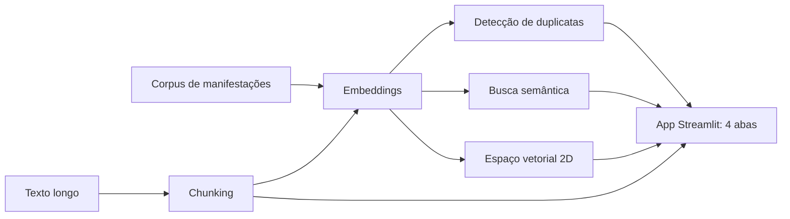
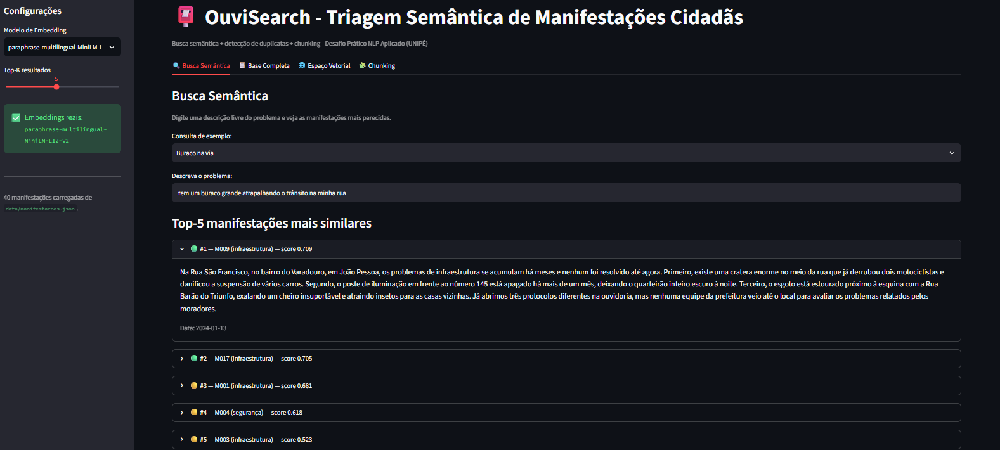
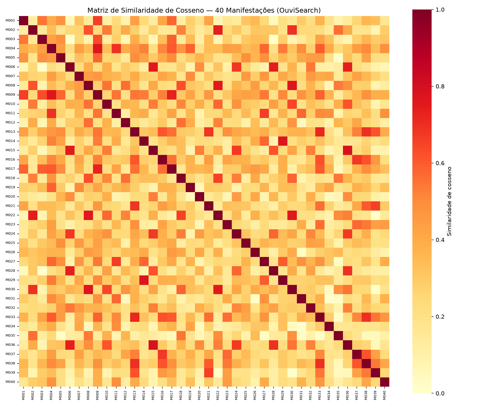
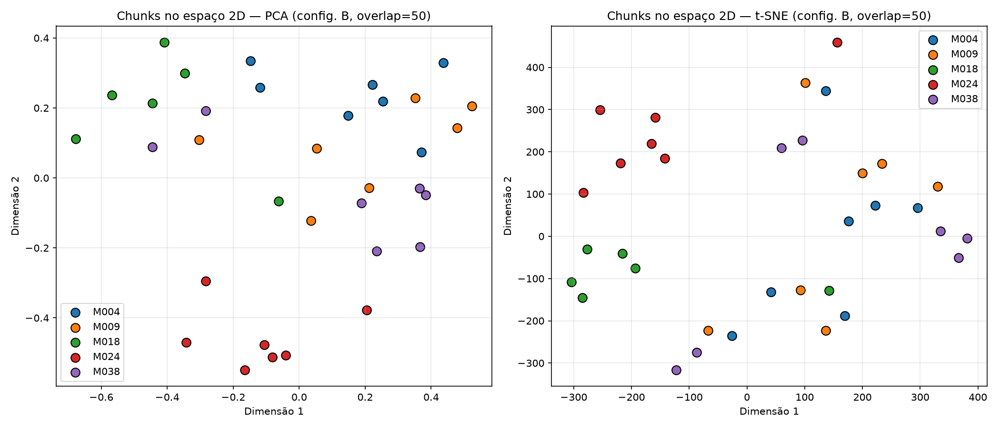

# OuviSearch – Triagem Semântica de Manifestações Cidadãs

OuviSearch é um protótipo de triagem semântica para uma Ouvidoria municipal: compara representações de texto (BoW, TF-IDF e embeddings densos), detecta manifestações duplicadas por similaridade de cosseno, aplica chunking em denúncias longas e oferece um buscador semântico interativo. Tudo isso em um painel Streamlit e em três notebooks de análise.

**Deploy da Aplicação:** [ouvisearch.streamlit.app](https://ouvisearch.streamlit.app/)

[](https://ouvisearch.streamlit.app/)

## Visão Geral

Este projeto é o Desafio Prático de NLP Aplicado da disciplina de Tendências em Ciência da Computação. A ideia é mostrar, com dados e números reais, por que representações vetoriais densas resolvem problemas que a busca por palavras-chave não resolve, e onde essas representações ainda falham.

---

## O Problema

A Ouvidoria Geral de um município recebe milhares de manifestações por mês via formulário online, hoje triadas por busca de palavras-chave (ex.: "buraco", "luz", "saúde"). Isso gera três falhas conhecidas:

| Falha da busca por palavra-chave | Exemplo |
|---|---|
| Duplicatas não detectadas | "asfalto esburacado" e "rua com buraco" são tratadas como diferentes |
| Temas relacionados não são agrupados | "falta de remédio no posto" e "demora na consulta" deveriam compor o mesmo cluster de "saúde pública" |
| Contexto perdido em textos longos | Manifestações com mais de 500 caracteres viram um único bloco indexado, sem granularidade |

Exemplo real do dataset: As manifestações M003 ("buraco enorme na Av. Epitácio Pessoa, em Manaíra") e M017 ("asfalto todo esburacado da avenida principal de Tambaú") descrevem o mesmo problema, mas quase não compartilham palavras de conteúdo, um buscador por palavra-chave nunca as uniria.

---

## A Solução

O OuviSearch ataca as três falhas em quatro entregas:

1. **Comparação de representações** -> Gera BoW, TF-IDF e embeddings para o corpus e compara a similaridade de cosseno entre pares de manifestações, discutindo as limitações de cada abordagem.
2. **Detecção de duplicatas** -> `detectar_duplicatas(textos, limiar)` calcula a matriz de similaridade completa, calibra um limiar e mede falsos positivos e negativos contra as duplicatas reais do dataset.
3. **Chunking** -> Divide as 5 manifestações mais longas com `RecursiveCharacterTextSplitter` em diferentes configurações de `(chunk_size, chunk_overlap)` e mede a coesão semântica entre chunks vizinhos.
4. **App Streamlit** -> Busca semântica interativa, matriz de similaridade, visualização 2D do espaço vetorial e chunking sob demanda.

Os resultados usam o modelo real `paraphrase-multilingual-MiniLM-L12-v2`. Se a biblioteca `sentence-transformers` não estiver disponível no ambiente, todas as entregas caem automaticamente em um **modo de simulação vetorial documentado** (TF-IDF + SVD/LSA), sem travar a execução.

---

## Fluxo da Aplicação



---

## Funcionalidades

* Comparação lado a lado de BoW, TF-IDF e embeddings nos pares de manifestações do enunciado.
* Detecção de duplicatas com matriz de similaridade (heatmap) e análise de falsos positivos e negativos.
* Chunking interativo com duas estratégias e `chunk_size`/`overlap` ajustáveis.
* Busca semântica com destaque de score por cor (🟢 > 0.7, 🟡 > 0.5, 🔴 demais).
* Visualização do espaço vetorial em 2D (PCA ou t-SNE), colorida por categoria oficial, com Silhouette Score.
* Sidebar com seleção de modelo de embedding e Top-K configurável.

---

## Demonstração

Deploy do App: [ouvisearch.streamlit.app](https://ouvisearch.streamlit.app/)

| <div align="center">OuviSearch</div> |
|---|
|  |

---

## Notebooks de Análise

Os três primeiros entregáveis são notebooks já executados, com código, tabelas e discussão dos resultados. Todos usam o mesmo corpus (`data/manifestacoes.json`) e o modelo `paraphrase-multilingual-MiniLM-L12-v2`.

| Notebook | Pergunta que responde | Resultado principal |
|---|---|---|
| [`analise_comparativa.ipynb`](./notebooks/analise_comparativa.ipynb) | BoW, TF-IDF e embeddings enxergam duplicatas? | Só os embeddings separam duplicatas (M003×M017 = 0.59, M008×M022 = 0.75) do par de controle (M008×M031 = 0.22). O TF-IDF chega a inverter o ranking em M003×M017 (0.16, abaixo do controle, 0.21). |
| [`deteccao_duplicatas.ipynb`](./notebooks/deteccao_duplicatas.ipynb) | Dá para detectar duplicatas por similaridade de cosseno? | O limiar do enunciado (0.85) não encontra nada (maior score = 0.79). Com 0.75: precisão 0.29 e revocação 0.67. M003×M017 fica na 43ª posição entre 780 pares. |
| [`chunking_manifestacoes.ipynb`](./notebooks/chunking_manifestacoes.ipynb) | O overlap ajuda a preservar o sentido dos chunks? | O overlap de 50 caracteres eleva a coesão entre chunks consecutivos de 0.26 para 0.41 (~1,6x). Chunks da mesma manifestação são o vizinho mais próximo em 62% dos casos. |

Os falsos positivos da detecção de duplicatas são, em geral, reclamações do mesmo tema em lugares diferentes (ex.: duas escolas sem merenda, com score 0.79, mais alto que o de qualquer duplicata real). O modelo mede proximidade de **assunto**, não identidade de **denúncia**; por isso a similaridade de cosseno serve melhor como triagem para um revisor humano do que como decisão automática.

Figuras geradas pelos notebooks:

| <div align="center">Matriz de similaridade (Entrega 2)</div> | <div align="center">Chunks no espaço 2D (Entrega 3)</div> |
|---|---|
|  |  |

Para executar, abra os notebooks **dentro da pasta `notebooks/`**, eles leem os dados de `../data/` e salvam as figuras em `../assets/`:

```bash
jupyter notebook notebooks/
```

O relatório com decisões, dificuldades e aprendizados está em [`relatorio_tecnico_ouvisearch.pdf`](./relatorio_tecnico_ouvisearch.pdf).

---

## Estrutura do Projeto

```
ouvisearch/
├── app_ouvidoria.py                   # Entrega 4 - app Streamlit
├── requirements.txt                   # Dependências
├── relatorio_tecnico_ouvisearch.pdf   # Decisões, dificuldades e aprendizados
├── notebooks/
│   ├── analise_comparativa.ipynb      # Entrega 1 - BoW x TF-IDF x embeddings
│   ├── deteccao_duplicatas.ipynb      # Entrega 2 - detecção de duplicatas
│   └── chunking_manifestacoes.ipynb   # Entrega 3 - chunking de textos longos
├── data/
│   └── manifestacoes.json             # 40 manifestações sintéticas (João Pessoa e Campina Grande)
├── assets/
│   ├── UI-ouvisearch.png              # Screenshot do app
│   ├── heatmap_similaridade.png       # Gerado pela Entrega 2
│   ├── chunks_2d.png                  # Gerado pela Entrega 3
│   └── requisitos-ouvidoria.pdf       # Requisitos originais do desafio
├── .streamlit/
│   └── config.toml                    # Configurações do Streamlit
└── README.md
```

---

## Instalação e Execução

A forma mais rápida de testar é acessar a versão hospedada em
[ouvisearch.streamlit.app](https://ouvisearch.streamlit.app/) (o app pode
levar cerca de 30 segundos para acordar no primeiro acesso). Para rodar
localmente, siga os passos abaixo.

### 1. Pré-requisitos

* Python 3.10 ou superior - [Download](https://www.python.org/downloads/)
* Git - para clonar o repositório

### 2. Clonar o repositório

```bash
git clone https://github.com/PLeonLopes/ouvisearch.git
cd ouvisearch
```

### 3. Ambiente virtual e dependências

```bash
# Criar o ambiente virtual
python -m venv venv

# Ativar
venv\Scripts\activate           # <- Windows
source venv/bin/activate        # <- macOS/Linux

# Instalar as dependências
pip install -r requirements.txt
```

> O `requirements.txt` instala o PyTorch a partir do índice **CPU-only** oficial, evitando baixar vários GB
> de pacotes CUDA que o projeto não usa. Na primeira execução, o `sentence-transformers` baixa o modelo de
> embeddings (~470 MB). Sem internet ou sem a biblioteca, notebooks e app caem automaticamente no modo de
> simulação vetorial (TF-IDF + SVD).

### 4. Rodar a aplicação

```bash
streamlit run app_ouvidoria.py
```

O app abre automaticamente no navegador (`http://localhost:8501`). Para os notebooks, veja a seção [Notebooks de Análise](#notebooks-de-análise).

---

## Como Usar

1. Na barra lateral, escolha o **modelo de embedding** e o **Top-K** de resultados. O painel confirma se o modelo real foi carregado ou se o app está no modo de simulação.
2. Na aba **🔍 Busca Semântica**, digite uma descrição livre ou escolha um exemplo:
   * `Buraco na via` - "tem um buraco grande atrapalhando o trânsito na minha rua"
   * `Falta de médico` - "não tem médico no posto de saúde perto de casa"
   * `Insegurança` - "muitos assaltos e falta de policiamento no bairro"
3. Na aba **📋 Base Completa**, veja as 40 manifestações e gere a matriz de similaridade.
4. Na aba **🌐 Espaço Vetorial**, visualize o corpus em 2D (PCA ou t-SNE) colorido por categoria oficial e confira o Silhouette Score.
5. Na aba **🧩 Chunking**, cole um texto longo, escolha a estratégia e os parâmetros, e veja os chunks gerados e a similaridade entre eles.

| Aba | O que observar |
|---|---|
| Busca Semântica | As manifestações mais parecidas com a sua descrição, com score colorido |
| Base Completa | O corpus inteiro e a matriz de similaridade entre todas as manifestações |
| Espaço Vetorial | Se os clusters semânticos coincidem com as categorias oficiais |
| Chunking | Como `chunk_size` e `overlap` mudam os pedaços gerados |

---

## Parâmetros

| Parâmetro | Faixa | Padrão | Para que serve |
|---|:---:|:---:|---|
| **Top-K** | 1 – 10 | 5 | Quantas manifestações a busca semântica retorna. |
| **Redução 2D** | PCA / t-SNE | PCA | Como o espaço vetorial é projetado em 2D (PCA é linear e rápido; t-SNE destaca vizinhanças locais). |
| **Estratégia de chunking** | RecursiveCharacter / Fixed-Size | RecursiveCharacter | Como o texto é dividido: respeitando parágrafos e frases, ou em cortes de tamanho fixo. |
| **Chunk size** | 50 – 500 | 150 | Tamanho máximo de cada chunk, em caracteres. |
| **Overlap** | 0 – 200 | 50 | Quantos caracteres do fim de um chunk se repetem no início do próximo. |

O **modelo de embedding** também é escolhido na barra lateral; o padrão é `paraphrase-multilingual-MiniLM-L12-v2`, multilíngue e o usado em todas as análises deste README.

---

## Autor

<div align="center">
  <table>
    <tr>
      <td align="center">
        <a href="https://github.com/PLeonLopes">
          <br />
          <sub><b>Pedro Nícollas Pereira Leon Lopes</b></sub>
        </a>
      </td>
    </tr>
  </table>
</div>

<p align="center">
  <sub>UNIPÊ — Centro Universitário de João Pessoa · Prof. Me. Ricardo Roberto de Lima</sub>
</p>
